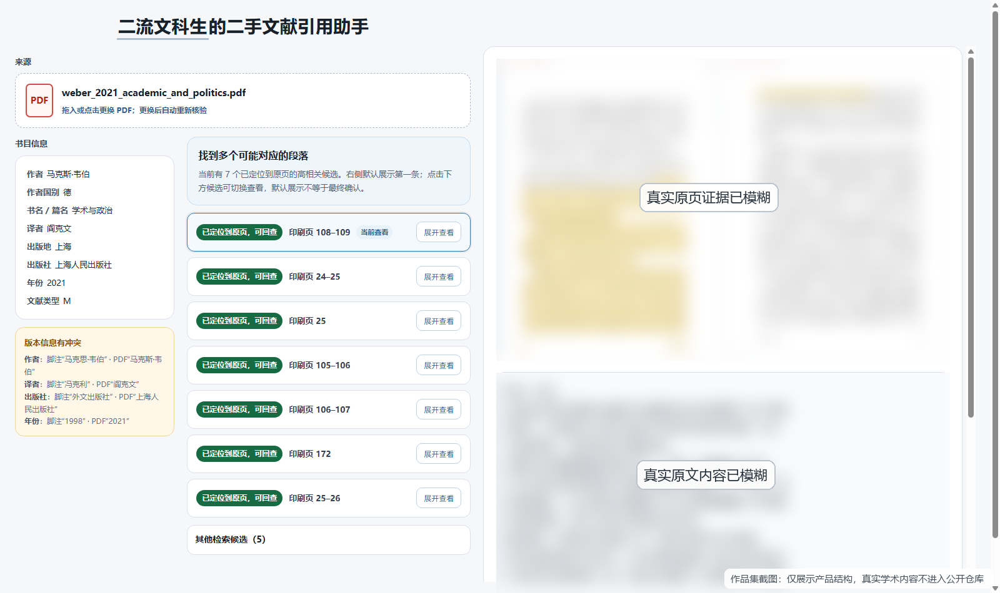
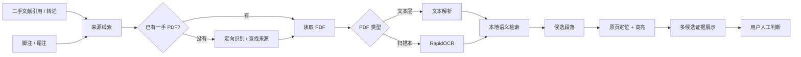

# 二流文科生的二手文献引用助手

> **给一条二手文献中的引用/转述 + 对应脚注 + 一手 PDF，返回值得人工核查的一手原文候选、原页证据和可追溯引用。**

这是一个面向人文社科研究场景的本地 MVP。它不替研究者判断“哪一段才是真理”，而是把原本需要在几百页 PDF 中反复翻找的工作，压缩成一组**可回查、可比较、可人工判断**的证据候选。

**当前状态：MVP v0.1.0｜真实案例评测完成｜桌面端 Demo 可用**

---

## 30 秒看懂

### 输入

1. 二手文献中的引用或转述；
2. 对应脚注 / 尾注；
3. 候选一手文献 PDF（已有 PDF 可直接上传）。

### 输出

- 可能对应的一手原文候选；
- PDF 原页 + 高亮；
- 对应原文；
- 书目信息与版本冲突提示；
- 可复制脚注 / 参考文献；
- 明确的“不确定 / 多候选 / 暂未定位”状态。

### 最重要的产品原则

> **机器负责找证据，人负责做学术判断。**

当多个段落都合理相关时，系统并列展示，不为了界面整齐强行选一个“唯一答案”。

---

## 为什么做这个

真实的人文社科写作里，经常会遇到这种情况：

> 二手作者说“韦伯认为……”，脚注指向一篇外文原作。
>
> 你想在自己的论文里使用这条观点，但需要知道：中文译本里到底怎么说？在第几页？上下文是什么？

普通搜索和聊天模型可以给出“像答案的文字”，但学术核查真正需要的是：

- **原文在哪里？**
- **是哪一版？**
- **页码能不能回查？**
- **这是不是机器自己猜出来的？**
- **如果有多个可能段落，能不能全部给我，而不是替我拍板？**

所以这个项目的核心不是“再做一个聊天机器人”，而是做一条**证据可追溯的引用核验流程**。

---

## 产品演示



结果页采用桌面端双工作区：

- 左侧：来源 PDF、书目信息、版本冲突、候选列表；
- 右侧：当前候选的原页证据、原文与引用；
- 右侧证据区独立滚动，避免长原文拖动整个页面。

完整演示步骤见：[`docs/DEMO_GUIDE.md`](docs/DEMO_GUIDE.md)

---

## 产品流程



---

## 技术路线：复用成熟组件，不重新发明 RAG

项目的技术决策不是“功能越多越好”，而是围绕一个最小目标：

> **找到相关段落后，还必须能回到 PDF 原页。**

主要复用：

- **PaperQA2**：文档分块与检索入口；
- **BAAI/bge-small-zh-v1.5**：本地中文向量检索；
- **pypdfium2 + Pillow**：PDF 文本层、字符坐标、原页渲染和高亮；
- **RapidOCR**：扫描 PDF 的可选 OCR 路径；
- **本地网页 UI**：完成上传、候选切换、原页查看与引用复制。

默认本地检索路径不需要付费模型调用；Fresh Case A / B 的正式评测均为 **0 模型调用 / $0.00**。

---

## 真实评测：不是只调通一个 Demo

MVP 使用多类真实材料做过评测：

| 案例 | 难点 | 结果 |
| --- | --- | --- |
| Weber Golden | 非逐字转述、版本冲突、多候选 | 正确证据进入候选并回到原页；保留多候选，不强制唯一答案 |
| C04 / T003 | 1800 页长 PDF、跨页候选 | 10/10 保存候选完成唯一原页定位，跨页高亮成立 |
| Plato / T006 | 459 页纯扫描 PDF | RapidOCR 路径可用；真实区域进入 Top-10 并回到原页 |
| Fresh Case A | 二手作者综合多处一手论述 | 检索命中多个相关区域；定位修复后 5 个候选可回页，生成 7 张高亮 |
| Fresh Case B | 同一句二手转述跨两组一手论证 | Top-1 即进入强相关区域；定位修复后形成可回查原页证据 |

M3 真实评测形成的结论：

- 当前语义检索**已经达到 MVP 的参考工具标准**；
- Top-1 不是“真理”，排序只是检索判断；
- 多段证据很常见，产品不应替用户强制选唯一答案；
- 真正影响可信度的不是“再多优化几个百分点的语义分数”，而是**能否稳定回到原页并诚实暴露不确定性**。

评测总报告：[`ops/M3_REAL_WORLD_EVALUATION_FINAL_REPORT_2026-10-05.md`](ops/M3_REAL_WORLD_EVALUATION_FINAL_REPORT_2026-10-05.md)

---

## 一个真实 Bug：检索找到了，为什么却高亮不出来？

Fresh Case A / B 暴露了一个很典型的 PDF 工程问题：

- 语义检索已经找到相关文本；
- 但 PDF 文本层包含肉眼相同、Unicode 编码不同的兼容字形；
- 定位器因此无法把检索结果重新贴回原页。

修复没有去“升级语义模型”，而是只增强原页定位层：

- 加入 **Unicode NFKC 兼容归一化**；
- 保持“规范化字符 → 原 PDF 字符框”的坐标映射；
- 不做宽松到会误高亮的模糊匹配；
- 仍然坚持：匹配不唯一就标记 ambiguous，不猜页码。

修复后：

- Fresh A：**0 → 5 个**可定位候选，**7 张**高亮；
- Fresh B：**0 → 1 个**可定位候选，成功回到 **PDF 110 页**；
- 语义检索、排序、embedding、`k` 均未改变。

详见：[`ops/LOCALIZATION_ROBUSTNESS_REPORT_2026-10-05.md`](ops/LOCALIZATION_ROBUSTNESS_REPORT_2026-10-05.md)

---

## 证据诚实性

这个项目刻意保留几类“失败”：

| 状态 | 含义 |
| --- | --- |
| 已找到可回查证据 | 候选已稳定定位到原页并可生成高亮 |
| 多个可能段落 | 多个候选都合理，交给用户判断 |
| 暂未找到可靠对应证据 | 检索可用，但没有足够可靠的原页定位 |
| 当前资料不足 | 例如扫描本没有文本层，也没有 OCR 缓存 |

系统不会：

- 把 PDF 顺序页冒充成印刷页码；
- 把外文脚注自动冒充成已核验的中文版本；
- 把检索分数当作“学术真相”；
- 为了好看而强行选择一个唯一答案；
- 在找不到时编造原文、高亮或书目信息。

---

## 回归保护

当前 MVP 的六套保护线：

- MVP / UI：**93 / 93**
- T003 原页定位：**18 / 18**
- T004 证据对象：**16 / 16**
- T006 OCR：**5 / 5**
- 来源获取：**106 / 106**
- Footnote-first：**58 / 58**

---

## 快速运行

验证环境：Windows + CPython 3.11。

```powershell
py -3.11 -m venv .venv
.\.venv\Scripts\python.exe -m pip install --upgrade pip
.\.venv\Scripts\python.exe -m pip install -r requirements.txt

$env:PQA_HOME = $PWD
.\.venv\Scripts\python.exe tools\mvp_app.py
```

浏览器打开：

```text
http://127.0.0.1:8765
```

本地嵌入模型首次使用如需下载：

```powershell
$env:MVP_ALLOW_MODEL_DOWNLOAD = "1"
```

扫描 PDF 的 OCR 路径是显式可选项，不会默认偷偷 OCR 整本。

---

## 项目边界

当前 MVP **不做**：

- 自动替研究者判断最终哪一段最重要；
- 自动评价二手作者是否曲解原文；
- 保证穷尽所有相关段落；
- 自动论文写作 / 文献综述；
- 通用知识库；
- 为了指标继续堆 reranker / query expansion / 多 Agent；
- 移动端适配。

这些不是“没来得及做”，而是当前产品边界。

---

## 项目材料

- [Demo 演示指南](docs/DEMO_GUIDE.md)
- [作品集 Case Study](docs/PORTFOLIO_CASE_STUDY.md)
- [简历与面试表达包](docs/RESUME_PACKAGE.md)
- [MVP Release Notes](docs/RELEASE_NOTES_v0.1.0.md)
- [M3 真实评测](ops/M3_REAL_WORLD_EVALUATION_FINAL_REPORT_2026-10-05.md)
- [定位鲁棒性修复](ops/LOCALIZATION_ROBUSTNESS_REPORT_2026-10-05.md)

---

## 数据与版权

代码、配置与项目文档可进入仓库；真实学术 PDF、OCR 文本、原页截图和其他私有材料保存在 `data/private/`，由 Git 忽略，不进入公开仓库。

公开 README 中只保留必要的评测指标与脱敏结果。

---

## 一句话总结

> **不是替文科生写论文，而是帮他更快找到“这句话到底从哪里来的”。**
