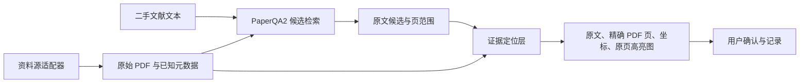

> 保存说明（2026-10-01）：以下完整保留已在对话中生成的 T002 Plan 正文。按用户最新指示，正式保存路径为 `ops/T002_ARCHITECTURE_PLAN.md`，替代正文末尾原拟定的 `ops/T002_PLAN.md`。正文中的工作区、Plan 模式与未写入状态是生成计划时的快照；本次仅保存计划、同步状态并提交推送，不授权或执行实现、依赖安装或下一实验。计划已成稿，架构采纳及实验启动仍待用户确认。

# T002：保留 PaperQA2 检索，补齐原页高亮证据链

## 1. 结论与依据

推荐最小组合：**现有 PaperQA2 / pypdf 检索路径 + pypdfium2 坐标与原页渲染 + Pillow 高亮叠加 + 独立证据记录**。先验证 C04，不更换检索框架。

本次只读检查确认：

- T001 保存的 10 个候选均能在缓存的对应页文本中唯一匹配，包括第 4 个候选跨 PDF 第 130–131 页的情况。
- 第 5 个候选仍是历史基线中的 PDF 第 109 页命中；这是复用结果，不是新检索成绩。
- 缓存与当前 PDF 的文件大小、修改时间一致。
- 你已选择高亮整个候选原文片段，暂不自动裁剪成最短对应句。
- 几何定位与截图尚未实测，不能据文本匹配宣称通过。

规划依据为本地 `origin/main` 的 `e60ecc2`，其中包含新版产品定义及计划简报。工作区落后 9 个提交，本次未同步或修改文件。

## 2. 组件取舍与备选路线

| 组件 | 取舍 | 理由 |
|---|---|---|
| PaperQA2 core API | 保留并薄封装 | 已证明 C04 候选检索可行；无需重建 RAG |
| 现有 pypdf、400/100 分块、bge-small-zh-v1.5 | 暂时保持 | 控制变量，复用已有结果 |
| PaperQA2 CLI agent、自动书目信息推断、默认长答案生成 | 不进入默认产品路径 | 已有中文搜索、元数据质量问题；长答案不是当前交付目标 |
| pypdfium2 + Pillow | 推荐新增 | 提供字符框、原页渲染及高亮叠加，当前环境尚未安装 |
| Docling | 第一备选 | 处理文本顺序或版面导致的定位失败，独立保留其 provenance |
| MinerU | 后续候选 | 当前没有证据需要更换整个解析路线 |
| PaddleOCR / OCRmyPDF | 仅用于 OCR 场景 | C04 当前不需要 OCR |

PDFium 提供字符框和页面到位图的坐标转换，但不负责完整的版面分析，适合先验证当前文本型 PDF。[PDFium API](https://pypdfium2.readthedocs.io/en/stable/python_api.html)

Docling 的 provenance 包含页码、边界框和字符范围；但检查到的 PaperQA2 Docling 适配器将普通正文合并为页文本，没有将正文坐标一路传入检索片段。因此，**仅切换 PaperQA2 的 reader 不足以保证高亮坐标保留**。[Docling 数据接口](https://docling-project.github.io/docling/reference/document_converter/)、[PaperQA2 适配器源码](https://raw.githubusercontent.com/Future-House/paper-qa/main/packages/paper-qa-docling/src/paperqa_docling/reader.py)

备选路线确定为：**Docling 独立解析并保存 provenance → PaperQA2 接收文本与证据标识 → 独立证据层返回页面位置**。仅在推荐路线失败后，对失败页面验证，不立即解析整本 1800 页。Docling 的块框不得冒充任意子句的精确字符框。

MinerU 已提供结构化页面及几何信息，暂保留调研结论，不与主路线并行测试。[MinerU 输出格式](https://opendatalab.github.io/MinerU/reference/output_files/)

## 3. 数据流与最小接口

第一版只接本地 PDF 资料源；后续数据库适配器提供相同文档入口，不直接参与分块、坐标计算或证据判定。

最小接口约定：

- **DocumentRef**：文档标识、PDF 路径、SHA-256、已知书目信息及其来源。未知字段为空；不用 `Rejoice2026` 作为可靠书目数据。
- **Candidate**：文档标识、候选标识、原始片段文本、排名、排名所属阶段、检索页范围。页范围是定位线索，不直接等同于已验证坐标。
- **Evidence**：候选标识、逐页原文范围、字符框、坐标系、原页图与高亮图、定位状态、人工确认状态。跨页候选拆成多个页面片段。
- 坐标保留 PDF 原生坐标及 CropBox、旋转信息，通过渲染器转换为图片像素坐标；不假定只翻转纵轴即可。
- PDF 页码统一对外使用从 1 开始的页序号；书籍印刷页码单独存储，未确认时为空。
- `located / ambiguous / unmatched / needs_ocr` 表示定位状态；人工确认另存，默认未确认。定位成功不代表引文已获原文支持。

后续新查询采用 `Docs.aadd_texts` 与 `Docs.retrieve_texts`，默认返回 10 个候选，跳过自动元数据推断和长答案生成。沿用当前本地 embedding；其检索排名需单独验证，不能继承 T001 完整查询链的 rank 5 成绩。

证据定位只允许薄适配：

- 保留原始文字；匹配副本仅消除空白差异，并保存到原字符的映射。
- 不删除正文中的数字、批注或汉字来强行匹配。
- 唯一完整匹配才生成“已定位”高亮；零匹配或多匹配明确返回失败或歧义。
- 使用 PDFium 的字符索引映射，避免把提取字符串下标直接当作字形下标；高亮采用字符框，避免一个大矩形覆盖无关正文。

OCR 回退：没有可用文本层的页面标记 `needs_ocr`；后续用 PaddleOCR 对原页渲染图返回文字与多边形，并明确标注 OCR 来源。OCRmyPDF 仅在需要生成可搜索 PDF 副本时考虑，本实验不引入。[PaddleOCR 输出示例](https://www.paddleocr.ai/main/en/quick_start.html)、[OCRmyPDF 文档](https://ocrmypdf.readthedocs.io/en/latest/)

## 4. 唯一下一实验：C04 候选到原页高亮

**目的：验证已有候选能否可靠变成可复核的页面证据，不重跑 T001。**

实施步骤：

1. 在计划获准后同步仓库，保留现有私有数据与基线配置。
2. 在项目虚拟环境增加 `pypdfium2`、`Pillow`，记录实际版本；不下载模型。
3. 读取既有 T001 结果、原 PDF 和页文本缓存，计算并记录文件指纹。
4. 对全部 10 个候选逐一定位，只读取候选涉及页面；gold 信息仅用于验收，不进入定位函数。
5. 从原 PDF 以 144 DPI 渲染整页，生成原页 PNG、透明高亮叠加后的 PNG，以及含原文、页码、坐标和状态的 JSON。
6. 产物置于已忽略的私有结果目录；公开报告只记录指标、耗时、依赖和失败原因。

**通过条件：**

- 10/10 候选均完成唯一、完整的非空白文字定位；第 5 个候选落在 PDF 第 109 页。
- 第 4 个候选分别产生第 130、131 页的正确高亮，不丢失跨页内容。
- 所有非空白字符都有有效位置；不以无关整段或整页框掩盖缺失。
- 检查全部候选截图：文字可读、高亮位置正确、上下文保留；人工验收单独记录。
- 新增模型/API 调用数为 0，新增模型费用为 0；原 PDF 与历史结果未改变。

**必要回归场景：**换行和空白差异、重复文本、找不到文本、跨页、旋转及裁剪页、没有文本层。重复或不存在的文本必须返回歧义或未匹配，不能生成猜测性高亮。

任一条件失败，记录推荐路线未通过及原因；不自动启动 Docling、MinerU 或付费重跑。下一次仅针对失败页验证已指定的 Docling 备选。

## 5. 工作量、边界与人工门槛

- 推荐实验预计 **1–2 个工程日**，包含薄适配、回归检查和截图核验；是估算，尚无几何处理实测耗时。
- 主要风险是 pypdf 与 PDFium 的文字顺序差异、PDF 字符索引与字符串下标不一致，以及跨页和旋转坐标转换。
- 当前不开发完整 UI、资料获取、引用样式系统或自动支持判断；产品范围仍遵循 PRODUCT_V0_1，本实验只验证其中的证据交付环节。
- 实验通过仅证明 C04 的可行性，不等同于架构永久选型或 M1 整体验收；两者仍由用户确认。
- 本轮只提交计划，没有安装、实现、付费调用或仓库写入。退出 Plan 模式后，先将本方案保存为 `ops/T002_PLAN.md`，同步项目状态、任务队列和运行日志；未经确认不改写持久架构决策。
